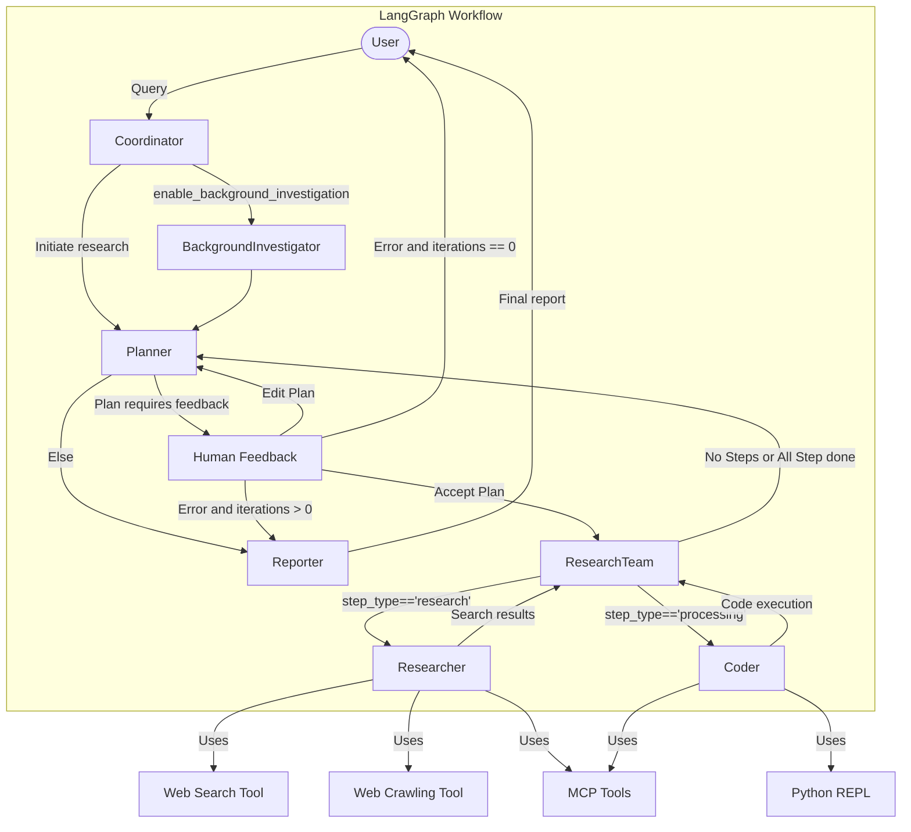
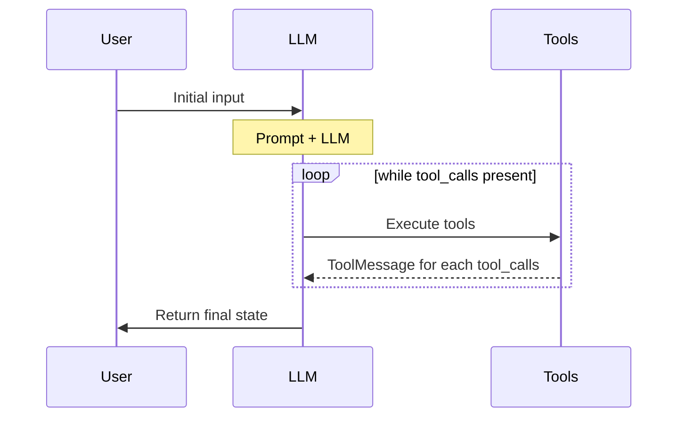

---
title:
draft: false
tags:
  - area/ai/agent
  - kind/note
  - state/draft
date: 2025-04-14
---
## 目标

- 了解整体执行流程
- Agent设计
- DeepResearch方式
- MCP使用方式

---

## 预备信息

- [[Agent设计]]
- [LangGraph](https://langchain-ai.github.io/langgraph/)
	- 状态图
	- 定义节点、边
	- 节点可以修改状态

---
## 整体设计

- LangGraph
- Agent设计：
	- **Coordinator**：入口，判断是否走planner
		- 人设, basic chat, rejection, goto planner
	- **Planner**：任务分解、规划的**战略**组件
	    - 分析研究目标并创建结构化执行计划
	    - 确定是否有足够的上下文或是否需要更多研究
	    - 管理研究流程并决定何时生成最终报告
	-  **Researcher Team**：执行计划
	    - **Researcher**：使用网络搜索引擎、爬虫甚至 MCP 服务等工具进行网络搜索和信息收集。
	    - **Coder**：使用 Python REPL 工具处理代码分析、执行和技术任务。
	     每个智能体都可以访问针对其角色优化的特定工具，并在 LangGraph 框架内运行
	- **Reporter**：汇总输出
		    - 汇总研究团队的发现
	    - 处理和组织收集的信息
	    - 生成全面的研究报告
---


---

- 发现了吗？**这是一个递归的图**

---

## 代码流程

```python
# 入口：server.py
uvicorn.run("src.server:app", ...)

# src/server/app.py
app = FastAPI(...)

graph = build_graph_with_memory()

@app.post("/api/chat/stream")
def chat_stream():
	...
	return StreamingResponse(
        _astream_workflow_generator(
            request.model_dump()["messages"],
			...
			request.interrupt_feedback, # human feedback
            request.mcp_settings,
		)
	)
	
async def _astream_workflow_generator(...)
	...
    async for agent, _, event_data in graph.astream(...):
		if xxx:
			yield xxx


# src/graph/builder.py
def _build_base_graph():
    """Build and return the base state graph with all nodes and edges."""
    builder = StateGraph(State)
    builder.add_edge(START, "coordinator")
    builder.add_node("coordinator", coordinator_node)
    builder.add_node("background_investigator", background_investigation_node)
    builder.add_node("planner", planner_node)
    builder.add_node("reporter", reporter_node)
    builder.add_node("research_team", research_team_node)
    builder.add_node("researcher", researcher_node)
    builder.add_node("coder", coder_node)
    builder.add_node("human_feedback", human_feedback_node)
    builder.add_edge("reporter", END)
    return builder


def build_graph_with_memory():
    """Build and return the agent workflow graph with memory."""
    # use persistent memory to save conversation history
    # TODO: be compatible with SQLite / PostgreSQL
    memory = MemorySaver()

    # build state graph
    builder = _build_base_graph()
    return builder.compile(checkpointer=memory)

# 两种 Node | Agent 实现
# src/graph/nodes.py
def coordinator_node(state: State) -> Command[Literal["planner", "background_investigator", "__end__"]]:
    """Coordinator node that communicate with customers."""
	...
    messages = apply_prompt_template("coordinator", state)
    response = (
        get_llm_by_type(AGENT_LLM_MAP["coordinator"])
        .bind_tools([handoff_to_planner])
        .invoke(messages)
    )
	...
		goto = "planner"
	...	
	return Command(
        update={"locale": locale},
        goto=goto,
    )

# src/agents/agents.py
from langgraph.prebuilt import create_react_agent

def create_agent(agent_name: str, agent_type: str, tools: list, prompt_template: str):
    """Factory function to create agents with consistent configuration."""
    return create_react_agent(
        name=agent_name,
        model=get_llm_by_type(AGENT_LLM_MAP[agent_type]),
        tools=tools,
        prompt=lambda state: apply_prompt_template(prompt_template, state),
    )
```
---
## 细节点

### Planning Prompt

- 信息度量标准：广度，深度，足够量
- 上下文评估：看是否需要feedback
- Web search condition
- Exclusions: research阶段不做calc
- **Analysis framework**
	- research information scope come from
- Exec rules
- Output format
- Notes: 重要信息
---

###  Researcher Prompt

- tools说明
- Steps
	- 理解问题
	- 使用工具
	- Plan
	- 执行
	- 合成信息
- Output format
- Notes

---

### MCP使用

- 主要依赖：`langchain_mcp_adapters.client import MultiServerMCPClient`
	- 作用：汇总MCP tools
- 在初始化research和coder的时候，判断`configurable.mcp_settings`，如果有mcp配置，且分配给了具体的agent，则获取所有对应tools给到被初始化agent

---
### human feedback

> 实现方式：[LangGraph: add-human-in-the-loop](https://langchain-ai.github.io/langgraph/how-tos/human_in_the_loop/add-human-in-the-loop/)

基本流程
- Graph -> human_feedback(node) -> langgraph.types.interrupt
- StreamingResponse -> `__interrupt__` message -> 图中断
- chat/stream -> { interrupt_feedback: xxx } -> graph(Command(resume)) 图恢复

---
## 思考

-  启发
	- MCP Tools
	- Human Feedback
	- Prompt is important
		- standards
		- thinking framework
		- output schema
- 改进
	- 太依赖 planner
	- 无并发
	- 上下文控制，信息提取及压缩

- Agent协同的代码实现都不复杂，难在Agent和Prompt的设计，信息的压缩提取
- langgraph抽象问题，复杂工具调用，如果出问题，到底是工具输出的问题还是模型归纳的问题
	- [langgraph-studio](https://langchain-ai.github.io/langgraph/concepts/langgraph_studio/)

---
- 以下内容来自`langgraph.prebuild.chat_agent_executor` 的 `create_react_agent`

The "agent" node calls the language model with the messages list (after applying the prompt).
If the resulting AIMessage contains `tool_calls`, the graph will then call the "tools".
The "tools" node executes the tools (1 tool per `tool_call`) and adds the responses to the messages list
as `ToolMessage` objects. The agent node then **calls the language model again**.
The process repeats until no more `tool_calls` are present in the response.
The agent then returns the full list of messages as a dictionary containing the key "messages".


---
## Talk is cheap

- show me the code

---
## References

- [DeepWiki_deer-flow](https://deepwiki.com/bytedance/deer-flow) 
	- 流程图有点老
