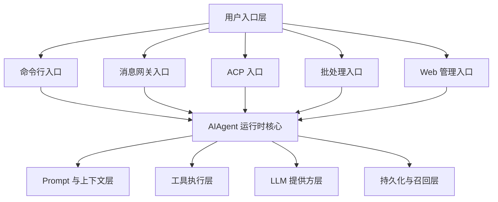
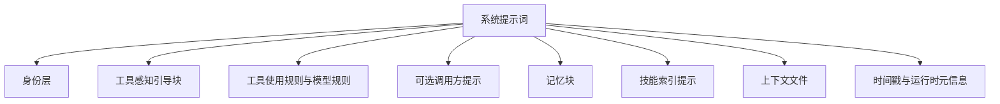
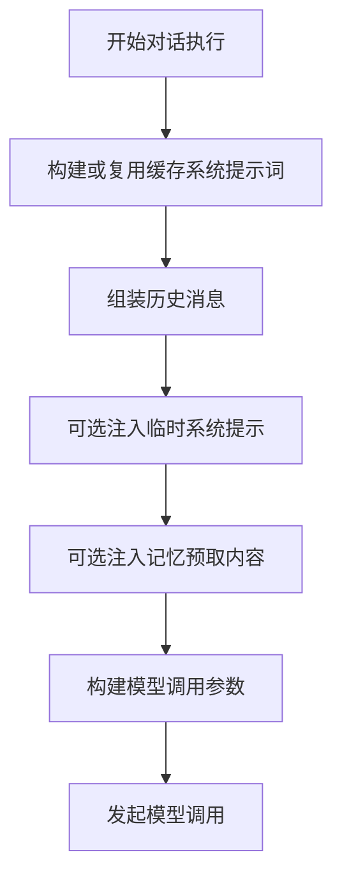
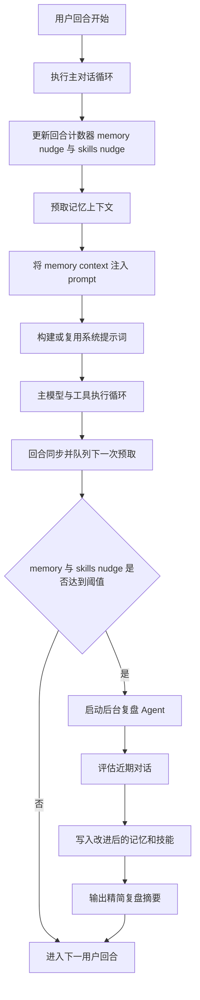

Hermes Agent 是一个以 Python 为核心、支持多入口交互的智能体运行时系统，围绕统一的 `AIAgent` 编排核心整合了 CLI、网关、ACP、工具系统、记忆机制和技能演化能力。

## 1) 项目结构 / 目录设计

Hermes 采用 monorepo 结构，以核心运行时为中心，被多个接口层共同调用。

### 按职责划分的关键目录

- 核心运行时 / 编排层
  - `run_agent.py`（`AIAgent`）
  - `model_tools.py`（工具发现与分发）
  - `toolsets.py`（工具分组定义）
- Agent 内部能力层
  - `agent/`（prompt 构建、记忆管理、上下文压缩、缓存、元数据）
- 工具层
  - `tools/`（工具处理器、注册中心、环境适配器）
- 状态与持久化层
  - `hermes_state.py`（SQLite + FTS5 搜索）
- 用户与运维入口层
  - `cli.py`、`hermes_cli/`（CLI 交互）
  - `gateway/`（消息平台集成）
  - `acp_adapter/`（ACP 服务模式）
  - `web/` 与 `website/`（管理页面与文档站）
  - `cron/`、`batch_runner.py`、`trajectory_compressor.py`（自动化与离线处理）

### 组件图（优化版）

## 2) 技术栈

- 语言 / 运行时
  - Python `>=3.11`（`pyproject.toml`）
  - TypeScript + React（Web 前端，`web/package.json`）
  - Node `>=18`（浏览器/前端工具链，`package.json`）
- AI / 模型生态
  - `openai`, `anthropic`
- 核心基础库
  - `pydantic`, `httpx`, `requests`, `tenacity`, `jinja2`, `pyyaml`, `rich`, `prompt_toolkit`
- 持久化
  - SQLite + FTS5（`hermes_state.py`）
- 前端栈（Web）
  - React 19、Vite、TailwindCSS 4（`web/package.json`）
- 可选集成能力
  - 消息平台：Telegram / Discord / Slack（通过 extras）
  - 语音/浏览器等扩展能力（通过 `pyproject.toml` 可选依赖）

## 3) Agent Prompt 结构（组成部分 + 结构图）

Prompt 的主组装逻辑在 `AIAgent._build_system_prompt()`，并由 `agent/prompt_builder.py` 提供辅助模块。

### Prompt 组成部分

1. Agent 身份层
   - 优先使用 `SOUL.md`，否则使用默认身份定义
2. 工具感知引导层
   - 按当前可用工具注入 memory/session search/skills 指导文本
3. 工具使用策略 + 模型特定操作提示
4. 可选的调用方 system message
5. 持久记忆块
   - 内建记忆 + 外部记忆管理器生成的记忆提示块
6. Skills 索引提示块
   - 动态从技能集合生成
7. 上下文文件块
   - 如 `AGENTS.md`、`.hermes.md`（含注入风险扫描）
8. 时间戳 + 运行环境/模型提示

### Prompt 结构图

### 运行时组装路径

## 4) 内建工具与技能系统

### 工具架构

- 工具注册中心在 `tools/registry.py`。
- 工具发现与导入由 `model_tools._discover_tools()` 完成。
- 调用路径：
  - LLM 产出 tool call -> `run_agent.py` 循环解析
  - Agent 会拦截部分特殊工具（todo/memory/session/delegation）
  - 其余通过 `model_tools.handle_function_call()` -> `registry.dispatch()` 执行

### Hermes 内建工具清单（what built in tools）

Hermes 官方内建工具参考里标注为 **47 个内建工具**（不含动态 MCP 工具）。

按工具集归类（核心名称）：

- browser（10）
  - `browser_navigate`, `browser_snapshot`, `browser_click`, `browser_type`, `browser_scroll`, `browser_back`, `browser_press`, `browser_get_images`, `browser_vision`, `browser_console`
- file（4）
  - `read_file`, `write_file`, `patch`, `search_files`
- terminal（2）
  - `terminal`, `process`
- web（2）
  - `web_search`, `web_extract`
- skills（3）
  - `skills_list`, `skill_view`, `skill_manage`
- memory（1）
  - `memory`
- session_search（1）
  - `session_search`
- todo（1）
  - `todo`
- delegation（1）
  - `delegate_task`
- code_execution（1）
  - `execute_code`
- clarify（1）
  - `clarify`
- cronjob（1）
  - `cronjob`
- messaging（1）
  - `send_message`
- vision（1）
  - `vision_analyze`
- image_gen（1）
  - `image_generate`
- tts（1）
  - `text_to_speech`
- moa（1）
  - `mixture_of_agents`
- homeassistant（4）
  - `ha_list_entities`, `ha_get_state`, `ha_list_services`, `ha_call_service`
- rl（10）
  - `rl_list_environments`, `rl_select_environment`, `rl_get_current_config`, `rl_edit_config`, `rl_start_training`, `rl_check_status`, `rl_stop_training`, `rl_get_results`, `rl_list_runs`, `rl_test_inference`

说明：
- 上述是“内建工具”；此外 Hermes 会通过 MCP 动态发现更多工具（名称通常带 server 前缀）。
- 工具可见性会受 toolset 配置、环境变量和凭证状态影响，不一定每次都全量可用。

### 内建技能相关模块

- `tools/skills_tool.py`
  - `skills_list`, `skill_view`
- `tools/skill_manager_tool.py`
  - `skill_manage`（create/edit/patch/delete/write/remove file）
- `agent/prompt_builder.py`
  - 生成并缓存 Skills 索引提示

## 5) 自进化实现机制（详细）

Hermes 在线运行时并不是一个单一 RL 回路，而是通过多个可落地的自改进闭环实现持续优化：

1. 记忆持久化与召回闭环
2. 技能创建/编辑闭环
3. 周期性后台复盘闭环（由 nudge 计数触发）
4. 基于 FTS5 + 总结的跨会话检索反馈闭环
5. 上下文优化/压缩闭环

### 技能升级闭环的关键 Prompt（最重要）

Hermes 的自进化在运行时有明确的 Prompt 触发与执行路径，关键分两层：

1) System Prompt 内的 skills 行为约束（前置策略）

- `agent/prompt_builder.py` 中 `SKILLS_GUIDANCE`（核心含义）：
  - 完成复杂任务（如 5+ 工具调用）、解决棘手问题、发现可复用流程后，要求用 `skill_manage` 保存为 skill。
  - 使用 skill 发现过时/错误时，要求立即 `skill_manage(action='patch')` 修补。

- 同文件 `build_skills_system_prompt()` 里的强约束（核心含义）：
  - 回复前先扫描技能，若相关必须 `skill_view(name)` 加载。
  - 发现技能有问题就 `skill_manage(action='patch')` 修复。
  - 难任务结束后要考虑沉淀为技能。

2) 回合后后台复盘 Prompt（后置学习）

- `run_agent.py` 定义三个复盘 Prompt：
  - `_MEMORY_REVIEW_PROMPT`
  - `_SKILL_REVIEW_PROMPT`
  - `_COMBINED_REVIEW_PROMPT`

- `_SKILL_REVIEW_PROMPT` 核心目标：
  - 回看对话是否出现非平凡方法、试错、路径调整、用户期望偏差等可复用经验。
  - 若已有相关 skill 则更新；否则创建新 skill。
  - 若无价值内容则返回 `Nothing to save.`

这三段 Prompt 由 `_spawn_background_review()` 在后台新建 review agent 执行，并直接写入共享 memory/skills 存储。

### 技能升级闭环触发条件（代码级）

- 计数器与阈值
  - `self._skill_nudge_interval`（默认 10）
  - `self._iters_since_skill`（每轮工具迭代累加）
- 触发逻辑
  - 当 `skill_manage` 可用且 `iters_since_skill >= skill_nudge_interval`，触发 skills review
- 复位逻辑
  - 一旦实际调用 `skill_manage`，`_iters_since_skill` 立即归零
- 执行时机
  - 主回复发送后再后台执行，不与当前任务争抢模型注意力

### 详细流程图

### 代码中的自进化实现点

- 记忆管理编排与生命周期钩子：
  - `agent/memory_manager.py`
- Nudge 计数与后台 review 触发：
  - `run_agent.py`
- Skills 变更引擎：
  - `tools/skill_manager_tool.py`
- 会话召回与连续性：
  - `tools/session_search_tool.py`, `hermes_state.py`
- 通过上下文压缩维持长会话可用性：
  - `agent/context_compressor.py`
- 离线轨迹压缩（数据流水线场景）：
  - `trajectory_compressor.py`

## 证据文件索引（快速定位）

- `website/docs/developer-guide/architecture.md`
- `website/docs/reference/tools-reference.md`
- `AGENTS.md`
- `run_agent.py`
- `model_tools.py`
- `toolsets.py`
- `agent/prompt_builder.py`
- `agent/memory_manager.py`
- `agent/context_compressor.py`
- `tools/registry.py`
- `tools/skills_tool.py`
- `tools/skill_manager_tool.py`
- `tools/session_search_tool.py`
- `hermes_state.py`
- `pyproject.toml`
- `web/package.json`
- `package.json`

