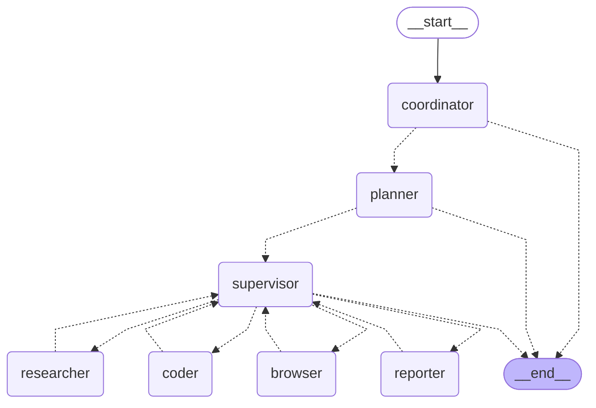

## 目标

- 了解整体执行流程
- 了解planning过程
- 了解各Agent职责
## 设计思路

- 使用langgraph来控制整体流程，graph中每个节点都是一个Agent
- Agent划分清晰

- 不用类型Agent使用不同类型的LLM
- Agent的Prompt及LLM支持自定义
## 整体流程

```python

# 入口：server.py
uvicorn.run("src.api.app:app", ...)

# src/app.py
app = FastAPI(...)

@app.post("/api/chat/stream")
async for event in run_agent_workflow(messages, ...):
	...
	yield { "event": event["event"], "data": json.dumps(event["data"], ensure_ascii=False) }
	...

# src/service/workflow_service.py
graph = build_graph()
async def run_agent_workflow(...):
	async for event in graph.astream_events(...)
		...
		yield ydata
		...

# src/graph/builder.py
def build_graph():
    """Build and return the agent workflow graph."""
    builder = StateGraph(State)
    builder.add_edge(START, "coordinator")
    builder.add_node("coordinator", coordinator_node)
    builder.add_node("planner", planner_node)
    builder.add_node("supervisor", supervisor_node)
    builder.add_node("researcher", research_node)
    builder.add_node("coder", code_node)
    builder.add_node("browser", browser_node)
    builder.add_node("reporter", reporter_node)
    return builder.compile()

```

### LangGraph

- 状态图
- 可以自定义节点和关系
- 每个节点可以获取或修改状态
## Agent细节

- coordinator：是否转交planner
- planner：生成plan和steps，单层，无递归，给supervisor
- supervisor：决定下一个执行节点，finish check
- **researcher**：调用tavily_tool & jina 神经搜索
- **coder**：python & bash
- **browser**：browser_use
- reporter：summary

> agent的好处是可以有自身现有的tools，去完成一个特定任务
## 思考

- 启发
	- 简单设计，flow和角色设计（直接抄）
	- ACI好一些
	- Agent通信格式良好
	- 站在巨人肩膀上，抽象更高，门槛更高，但整体结构更清晰
		- langgraph、jina、browser_use
	- prompt还是挺重要的
- 改进
	- 任务并发
	- 上下文控制（research内容分段选择、Rank）
	- MCP Tools
## Talk is cheap
## References

- [[Agent设计]]
- [[OpenManus源码分析]]
- [[UI-TARS-desktop源码分析]]