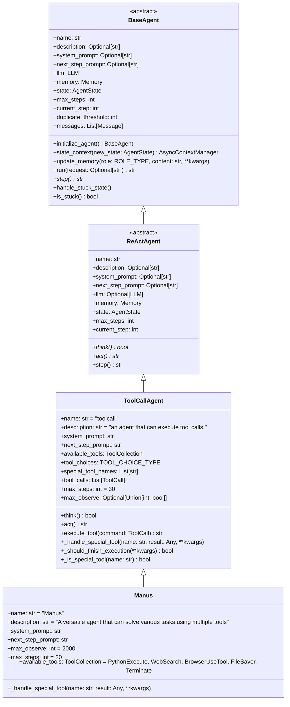

## 目标

- 了解整体执行流程
- 了解planning过程
- 使用了哪些tools
## 介绍

在Manus发布后，几天的时间内完成的，好像说是3个小时把主体流程就写完了
## 设计思路

- 与anthropic的最佳实践类似，代码主要分为以下几个模块
	- agent：specific task
	- flow：目前只有plan的flow
	- tools
## 整体流程

```python
## 入口
# run_flow.py
agents = { "manus": Manus(), } # agent初始化
prompt = input('')

flow = FlowFactory.create_flow(flow_type=FlowType.PLANNING, agents=agents) # factory
flow.execute()
# ...

## planning, app/flow/planning.py
class PlanningFlow()
	llm: # init llm
	
    def __init__(): # planning tool
	    ...
    
	async def execute(self, input_text: str) -> str:
	    _create_initial_plan() # call llm (prompt) -> steps -> saved to planning tool
		while True:
			# mark not start to 'in progress'
			#   and only return not start or in progress steps
			self.current_step_index, step_info = self._get_current_step_info()
			# no more steps
			if self.current_step_index is None:
                result += await self._finalize_plan()
                break

			self.get_executor(step_type) # get the agent from agents mapped by step_key
			self._execute_step()

	async def _create_initial_plan(self, request: str) -> None:
        """Create an initial plan based on the request using the flow's LLM and PlanningTool."""

        # Create a system message for plan creation
        system_message = Message.system_message(
            "You are a planning assistant. Create a concise, actionable plan with clear steps. "
            "Focus on key milestones rather than detailed sub-steps. "
            "Optimize for clarity and efficiency."
        )

        # Create a user message with the request
        user_message = Message.user_message(
            f"Create a reasonable plan with clear steps to accomplish the task: {request}"
        )

        # Call LLM with PlanningTool
        response = await self.llm.ask_tool(
            messages=[user_message],
            system_msgs=[system_message],
            tools=[self.planning_tool.to_param()],
            tool_choice=ToolChoice.AUTO,
        )


	async def _execute_step(self, executor: BaseAgent, step_info: dict) -> str:
		step_prompt = f"""
			CURRENT PLAN STATUS:
			{plan_status}
		
			YOUR CURRENT TASK:
			You are now working on step {self.current_step_index}: "{step_text}"
		
			Please execute this step using the appropriate tools. When you're done, provide a summary of what you accomplished.
	"""
		
		executor.run(step_prompt) # default use primary agent (Manus agent from the init)
		await self._mark_step_completed()

```

## 关键细节

### **agent类设计**



### 主要流程 **run**
```python
	# BaseAgent
	async def run(self, request: Optional[str] = None) -> str:
		while (self.current_step < self.max_steps and self.state != AgentState.FINISHED):
			# ...
			step_result = await self.step()
			# ...
			results.append(f"Step {self.current_step}: {step_result}")
			# ...

	# ReActAgent
	async def step(self) -> str:
		should_act = await self.think()
        if not should_act:
            return "Thinking complete - no action needed"
        return await self.act()

	# ToolCallAgent
	async def think(self) -> bool:
		response = await self.llm.ask_tool(...,tools=self.available_tools.to_params(),)
		self.tool_calls = response.tool_calls
		self.memory.add_message(assistant_msg)
		
	async def act(self) -> str:
		for command in self.tool_calls:
			# ...
			result = await self.execute_tool(command)
			# ...
			self.memory.add_message(tool_msg)
			results.append(result)

        return "\n\n".join(results)
        
	async def execute_tool(self, command: ToolCall) -> str:
		#...
		result = await self.available_tools.execute(name=name, tool_input=args)
		# ...
		# Handle special tools like `finish`
		await self._handle_special_tool(name=name, result=result)
```

## 目标解答

- planning过程：主要通过实例化planning的flow和tools来实现，虽然代码库里有一个planning的agent，但并未使用，所以目前不存在递归或子任务的情况，所有的steps是在一开始初始化完成的
- 使用的tools包括：PlanningTool, PythonExecute, WebSearch, BrowserUseTool, FileSaver, Terminate
## Talk is cheap

## 思考

- 启发
	- 简单设计，避免引入不必要的抽象层
	- Agent和Tool的逻辑是可复用的
	- Effective Agent影响：agent(with memory), flow, tools
- 改进
	- MCP Tools can give more flexibility
	- Planning tools is not enough, but when the planning has sub steps or recursive steps , you should check for unique and reasonable for those steps. That'll be complicated
	- The built-in tools is not work in sandbox, there may be some risks.

## References

- [[Agent设计]]
- [[OpenManus源码分析]]
- [[LangManus源码分析]]
- [[UI-TARS-desktop源码分析]]