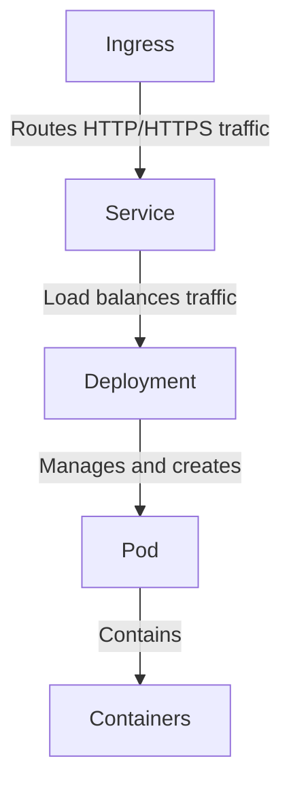
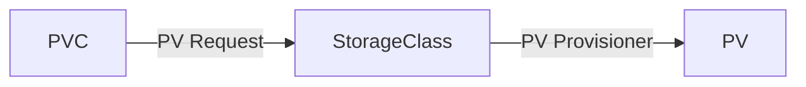

---
tags:
- Area/Dev/K8s
---

## 安装

- 可使用 [kubeasz](https://github.com/easzlab/kubeasz) 来快递安装，kubeasz是一套基于ansible的安装脚本，可集群化安装

## 基本概念

- Pod: Group of container, share ip
- Deployment: manage pod, scaling unit
- Service: load balancing, routing traffic to pods, expose pods internally and externally
- Ingress: route path and host, ssl support

- 存储资源
		- PersistentVolume(PV): cluster resource
	- PersistentVolumeClaim(PVC): request for cluster resource
	- StorageClass: PV provisioner

## 常用命令

```bash
kubectl cluster-info

kubectl get {pods,svc,deployments} -A
kubectl describe {service,pod,deployment} -n cluster_name res_name
kubectl scale deployment deploy_name --replicas=1 -n cluster_name
kubectl apply -f config.yml
```

## Tools

- helm
- KubeSphere: 开源容器平台
- Rancher